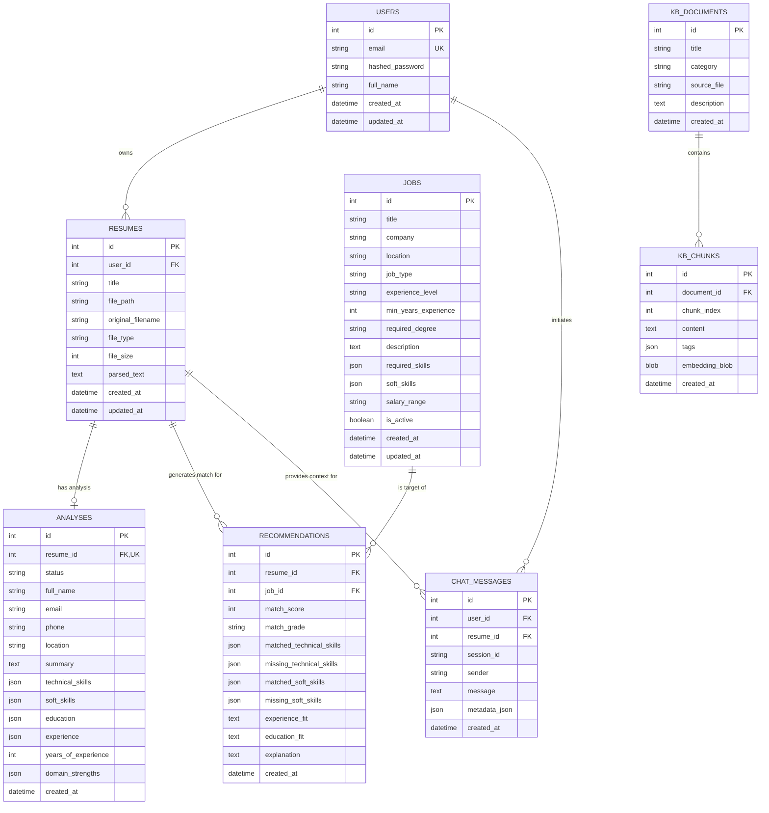

# AI Resume Analyzer — Database ER Diagram & Table Specifications

> **Database Specification**: Complete Relational Schema & Vector Storage Definitions for SQLite (`data/app.db`).

---

## 1. Mermaid Entity-Relationship (ER) Diagram

---

## 2. Table Specifications

### 2.1 Table: `users`
Stores user authentication credentials and account metadata.

| Column | Data Type | Constraints | Description |
|---|---|---|---|
| `id` | INTEGER | PRIMARY KEY AUTOINCREMENT | Unique user identifier |
| `email` | VARCHAR(255) | UNIQUE, NOT NULL | User email address (login username) |
| `hashed_password` | VARCHAR(255) | NOT NULL | Bcrypt hashed password |
| `full_name` | VARCHAR(255) | NOT NULL | User's full display name |
| `created_at` | DATETIME | DEFAULT CURRENT_TIMESTAMP | Account registration timestamp |
| `updated_at` | DATETIME | DEFAULT CURRENT_TIMESTAMP | Account modification timestamp |

**Indexes**:
- `idx_users_email` ON `users(email)`

---

### 2.2 Table: `resumes`
Stores uploaded resume file metadata and extracted text.

| Column | Data Type | Constraints | Description |
|---|---|---|---|
| `id` | INTEGER | PRIMARY KEY AUTOINCREMENT | Unique resume identifier |
| `user_id` | INTEGER | NOT NULL, FK(`users.id`) ON DELETE CASCADE | Owner user ID |
| `title` | VARCHAR(255) | NOT NULL | User-assigned title for resume |
| `file_path` | VARCHAR(512) | NOT NULL | Relative disk path in `data/uploads/` |
| `original_filename` | VARCHAR(255) | NOT NULL | Original uploaded filename |
| `file_type` | VARCHAR(50) | NOT NULL | Document extension (`pdf` or `docx`) |
| `file_size` | INTEGER | NOT NULL | Size in bytes |
| `parsed_text` | TEXT | NULLABLE | Raw text extracted from document |
| `created_at` | DATETIME | DEFAULT CURRENT_TIMESTAMP | Upload timestamp |
| `updated_at` | DATETIME | DEFAULT CURRENT_TIMESTAMP | Modification timestamp |

**Indexes**:
- `idx_resumes_user_id` ON `resumes(user_id)`

---

### 2.3 Table: `analyses`
Stores AI Resume Analyzer Agent output (1:1 relationship with `resumes`).

| Column | Data Type | Constraints | Description |
|---|---|---|---|
| `id` | INTEGER | PRIMARY KEY AUTOINCREMENT | Unique analysis identifier |
| `resume_id` | INTEGER | UNIQUE, NOT NULL, FK(`resumes.id`) ON DELETE CASCADE | Parent resume ID |
| `status` | VARCHAR(50) | NOT NULL, DEFAULT 'completed' | Status (`pending`, `completed`, `failed`) |
| `full_name` | VARCHAR(255) | NULLABLE | Candidate name extracted by AI |
| `email` | VARCHAR(255) | NULLABLE | Candidate contact email |
| `phone` | VARCHAR(100) | NULLABLE | Candidate contact phone |
| `location` | VARCHAR(255) | NULLABLE | Candidate current location |
| `summary` | TEXT | NULLABLE | AI-generated executive summary |
| `technical_skills` | JSON / TEXT | NULLABLE | Extracted technical skills list |
| `soft_skills` | JSON / TEXT | NULLABLE | Extracted soft skills list |
| `education` | JSON / TEXT | NULLABLE | Structured education list |
| `experience` | JSON / TEXT | NULLABLE | Structured work history list |
| `years_of_experience` | INTEGER | DEFAULT 0 | Calculated total years of experience |
| `domain_strengths` | JSON / TEXT | NULLABLE | Identified domain strengths list |
| `created_at` | DATETIME | DEFAULT CURRENT_TIMESTAMP | Analysis execution timestamp |

**Indexes**:
- `idx_analyses_resume_id` ON `analyses(resume_id)`

---

### 2.4 Table: `jobs`
Stores job postings against which resumes are evaluated.

| Column | Data Type | Constraints | Description |
|---|---|---|---|
| `id` | INTEGER | PRIMARY KEY AUTOINCREMENT | Unique job posting identifier |
| `title` | VARCHAR(255) | NOT NULL | Job position title |
| `company` | VARCHAR(255) | NOT NULL | Hiring company name |
| `location` | VARCHAR(255) | NOT NULL | Location (city, state, Remote) |
| `job_type` | VARCHAR(100) | NOT NULL, DEFAULT 'Full-time' | Employment type (`Full-time`, `Remote`, etc.) |
| `experience_level` | VARCHAR(100) | DEFAULT 'Mid' | Career level (`Entry`, `Mid`, `Senior`) |
| `min_years_experience` | INTEGER | DEFAULT 0 | Minimum required years of experience |
| `required_degree` | VARCHAR(100) | DEFAULT 'Bachelor' | Required degree tier |
| `description` | TEXT | NOT NULL | Complete job posting text |
| `required_skills` | JSON / TEXT | NOT NULL | Required technical skills list |
| `soft_skills` | JSON / TEXT | NULLABLE | Desired soft skills list |
| `salary_range` | VARCHAR(100) | NULLABLE | Display salary range |
| `is_active` | BOOLEAN | DEFAULT 1 | Active status flag |
| `created_at` | DATETIME | DEFAULT CURRENT_TIMESTAMP | Posting creation timestamp |
| `updated_at` | DATETIME | DEFAULT CURRENT_TIMESTAMP | Modification timestamp |

**Indexes**:
- `idx_jobs_title` ON `jobs(title)`
- `idx_jobs_job_type` ON `jobs(job_type)`
- `idx_jobs_is_active` ON `jobs(is_active)`

---

### 2.5 Table: `recommendations`
Stores evaluation results from AI Job Matching Agent.

| Column | Data Type | Constraints | Description |
|---|---|---|---|
| `id` | INTEGER | PRIMARY KEY AUTOINCREMENT | Unique recommendation record ID |
| `resume_id` | INTEGER | NOT NULL, FK(`resumes.id`) ON DELETE CASCADE | Evaluated resume ID |
| `job_id` | INTEGER | NOT NULL, FK(`jobs.id`) ON DELETE CASCADE | Evaluated job posting ID |
| `match_score` | INTEGER | NOT NULL | Composite match score (0 - 100) |
| `match_grade` | VARCHAR(50) | NOT NULL | Score tier (`Exceptional`, `High`, `Moderate`, `Low`) |
| `matched_technical_skills`| JSON / TEXT | NULLABLE | Overlapping technical skills list |
| `missing_technical_skills`| JSON / TEXT | NULLABLE | Missing required technical skills list |
| `matched_soft_skills` | JSON / TEXT | NULLABLE | Overlapping soft skills list |
| `missing_soft_skills` | JSON / TEXT | NULLABLE | Missing soft skills list |
| `experience_fit` | TEXT | NULLABLE | Experience comparison notes |
| `education_fit` | TEXT | NULLABLE | Education comparison notes |
| `explanation` | TEXT | NULLABLE | Qualitative AI rationale paragraph |
| `created_at` | DATETIME | DEFAULT CURRENT_TIMESTAMP | Evaluation timestamp |

**Constraints**:
- `UNIQUE(resume_id, job_id)`

**Indexes**:
- `idx_recommendations_resume_id` ON `recommendations(resume_id)`
- `idx_recommendations_score` ON `recommendations(match_score DESC)`

---

### 2.6 Table: `chat_messages`
Stores interactive chat logs with Career Advisor Agent.

| Column | Data Type | Constraints | Description |
|---|---|---|---|
| `id` | INTEGER | PRIMARY KEY AUTOINCREMENT | Unique message identifier |
| `user_id` | INTEGER | NOT NULL, FK(`users.id`) ON DELETE CASCADE | Participating user ID |
| `resume_id` | INTEGER | NULLABLE, FK(`resumes.id`) ON DELETE SET NULL | Active resume context ID |
| `session_id` | VARCHAR(100) | NOT NULL | Grouping UUID for chat conversation |
| `sender` | VARCHAR(50) | NOT NULL | Message origin (`user` or `assistant`) |
| `message` | TEXT | NOT NULL | Message text payload |
| `metadata_json` | JSON / TEXT | NULLABLE | Structured recommendations / action items |
| `created_at` | DATETIME | DEFAULT CURRENT_TIMESTAMP | Message timestamp |

**Indexes**:
- `idx_chat_session_id` ON `chat_messages(session_id)`
- `idx_chat_user_id` ON `chat_messages(user_id)`

---

### 2.7 Table: `kb_documents`
Stores parent documents in RAG knowledge base corpus.

| Column | Data Type | Constraints | Description |
|---|---|---|---|
| `id` | INTEGER | PRIMARY KEY AUTOINCREMENT | Unique knowledge base doc ID |
| `title` | VARCHAR(255) | NOT NULL | Document title |
| `category` | VARCHAR(100) | NOT NULL | Domain category (`skill`, `resource`, `roadmap`, `resume_tip`) |
| `source_file` | VARCHAR(255) | NULLABLE | File path in `data/kb_data/` |
| `description` | TEXT | NULLABLE | Summary description |
| `created_at` | DATETIME | DEFAULT CURRENT_TIMESTAMP | Index creation timestamp |

---

### 2.8 Table: `kb_chunks`
Stores chunked knowledge base text and 384-dim vector embeddings for RAG vector search.

| Column | Data Type | Constraints | Description |
|---|---|---|---|
| `id` | INTEGER | PRIMARY KEY AUTOINCREMENT | Unique chunk ID |
| `document_id` | INTEGER | NOT NULL, FK(`kb_documents.id`) ON DELETE CASCADE | Parent document ID |
| `chunk_index` | INTEGER | NOT NULL | Order sequence index within parent doc |
| `content` | TEXT | NOT NULL | Raw text content of chunk (~500 chars) |
| `tags` | JSON / TEXT | NULLABLE | Metadata tags JSON array |
| `embedding_blob` | BLOB | NULLABLE | 384-float dense vector binary array. Nullable and currently unused — retrieval runs the documented TF-IDF / keyword-overlap fallback (`app/services/vector_store.py`), so no embeddings are written. |
| `created_at` | DATETIME | DEFAULT CURRENT_TIMESTAMP | Chunk indexing timestamp |

**Indexes**:
- `idx_kb_chunks_document_id` ON `kb_chunks(document_id)`
